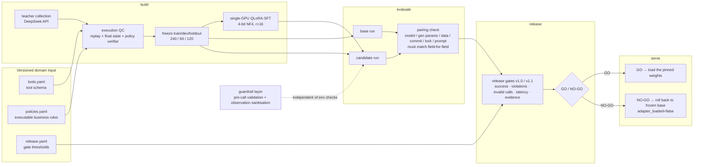

# RetailAgentOps

**A single-GPU domain-adaptation and release pipeline for retail tool-calling agents.**
It turns tool schemas, business policies and tasks into executable trajectories, then runs the
full loop — data QC → QLoRA post-training → execution-based evaluation → GO/NO-GO release
gates → inference service — on one consumer GPU.

**What is actually verifiable by you**: the CPU chain reproduces from a fresh clone and asserts
content hashes (one command, below). The GPU-side numbers (120-task holdout, dev, OOD) trace to
a run's `run_id`, which is the self-hash of all fields of that evidence — but **the evidence files
and model weights are not distributed with the repository** (`reports/retail_ops/` and `models/`
are gitignored; see [`NOTICE.md`](./NOTICE.md)). So: you can run the pipeline and the gates
yourself; you cannot replay the specific trajectories from my runs.

**One exception, and it is the one that matters most**: "training material and evaluation
material are disjoint" underpins every out-of-distribution claim in this project, and the
SHA-256 digests of *both* sides are **committed to Git**
([`manifests/retail_ops/v1/phrasing_exclusivity.json`](manifests/retail_ops/v1/phrasing_exclusivity.json)).
The empty intersection is therefore **set arithmetic you can run yourself** — no trust in me
required; the plaintext still never leaves my machine (SHA-256 is one-way). Where the private
artifacts *are* present, a second test pins "manifest == recomputed from artifacts", so the
manifest cannot be fabricated either.

[中文](./README.md) ｜ [Spec](./SPEC.md) ｜ [Model card](./docs/MODEL_CARD_sft-006.md) ｜
[System card](./docs/SYSTEM_CARD.md) ｜ [Interview notes](./docs/INTERVIEW_PREP.md)

> Most in-depth documents are in Chinese. This page carries the complete set of headline
> results and boundaries; the linked documents carry the per-run detail.

---

## The three things worth looking at

**1. It separates the contribution of prompt engineering from that of post-training.**
A 2×3 paired experiment (2 prompts × 3 capacity levels — none / attention-only / all-linear) over six runs,
60 frozen tasks per cell, shows the two fix **different failures** with almost no overlap:
one explicit authorisation sentence moves "correctly judged refundable but afraid to act"
from 5/10 to 9/10 and leaves "retry after a tool failure" **completely unchanged**;
post-training moves the retry class from 5/10 to 10/10.

**2. It can reject its own candidate — and did, three times.**
The first three observations on the sealed holdout were all `NO-GO`. The hardest one:
the candidate scored **120/120**, **+14.2pp** task success, zero policy violations and zero
invalid calls — rejected purely on a p95 latency ratio of 1.88 > 1.25.
**No threshold was changed** (a test asserts the gate config is field-for-field identical to
the previous version). The fourth observation **merged the LoRA back into the base weights**:
same weights, same behaviour, identical tool-call counts, p95 ratio **1.13** — the project's
first automatic-gate **`GO`**, which has since passed the independent-rebuild check
(SPEC §6, gate 6) — **the final candidate has been rebuilt too**, both candidates have.

**3. It built an out-of-distribution set that knocked that GO down by half — then fixed it, and priced the fix.**
The same candidate scores only **0.5833** out-of-template and **0/20** on the "say it
differently" class — *worse than the untrained base*. **120/120 is not generalisation**: the
frozen holdout shares its 12 request templates with the training set
([`docs/OOD_EVALUATION.md`](docs/OOD_EVALUATION.md)).

The mechanism was then diagnosed (all 12 templates are formal "please verify…" imperatives, so
the model learned **surface form → action**), and fixed with an LLM phrasing bank used for
training augmentation: **1.0000 and 0.9833** on **two independently generated sealed
partitions, each observed exactly once** (same weights; untrained base 0.7667 / 0.7333), and
`expression_ood` **0.00 → 1.00** on an independently hand-written set **never used for
selection**. **The cost is equally concrete**: the model became more action-prone — on the
sealed 120, two runs of the same config produced **2 and 7 policy violations**, and
"impossible request" handling fell 0.75 → 0.60. See
[`docs/GENERALIZATION_FIX.md`](docs/GENERALIZATION_FIX.md).

> Quoting that GO without the out-of-distribution reading is forbidden, and enforced by a test
> (`test_the_go_is_never_quoted_without_the_ood_reading`).

---

## Architecture



Artifacts flow one way and are never overwritten: `build` produces data → `evaluate` produces
evidence → `release` produces a decision → `serve` only consumes decisions. The dependency
direction `product_cli → retail_ops.* → core.*` is locked by a governance test.

### Four mechanisms that make the results trustworthy

| Mechanism | How |
|---|---|
| **Run evidence cannot be forged** | A run report's ID is the self-hash of **all** its own fields — change one byte and loading fails (tamper-tested). There is also **per-artifact SHA-256 binding**, but it can only be exercised where the private artifacts are present, and those are not distributed with the repo; on 2026-08-16 it was exercised end-to-end once locally against the two R5 rebuilds (including a one-byte edit to `trajectories.jsonl` being rejected) |
| **Paired comparison has preconditions** | Model revision, generation params, dataset version, code commit, `uv.lock` and system-prompt hash must be **identical field-for-field**, otherwise loading fails |
| **The holdout is sealed** | Two-stage authorisation gate plus five-dimensional fingerprint isolation; every observation logged in [`HOLDOUT_LEDGER.md`](docs/HOLDOUT_LEDGER.md) |
| **Gates may be versioned, never edited in place** | `GATE_IDS` v1.0 is frozen byte-for-byte (editing it would make every existing release report unloadable); new semantics ship as v1.1 and both coexist |

---

## Headline results

> The single source of truth for observation counts and per-run readings is
> [`docs/HOLDOUT_LEDGER.md`](docs/HOLDOUT_LEDGER.md).

### Sealed 120-task holdout (Qwen3-4B)

> Per-observation readings, decisions and the caveats that must accompany every `GO`
> live in [`docs/HOLDOUT_LEDGER.md`](docs/HOLDOUT_LEDGER.md) (single source of truth).

| Obs. | Candidate | task_success | Policy violations | Invalid calls | p95 ratio | Decision |
|---|---|---|---|---|---|---|
| 1 (2026-08-11) | R3, attention-only | 0.7500 (90/120) | 16 → **0** | 41 → **0** | 1.0870 | **NO-GO** (`success_delta` −0.0333) |
| 2 (2026-08-14) | R4 `sft-006`, all-linear | **1.0000 (120/120)** | 11 → **0** | 5 → **0** | **1.8774** | **NO-GO** (latency) |
| 3 (2026-08-15) | same, after code freeze | **1.0000** (bit-identical) | 0 | 0 | 2.0250 | **NO-GO** (latency) |
| 4 (2026-08-15) | **same weights, merged into base** | **1.0000** | 0 | 0 | **1.1265** | **`GO` / candidate (merged)** |
| 5 (2026-08-17) | **R6 `sft-008` (phrasing-augmented), merged** | 0.9750 (**117/120**) | 11 → **2** | 0 | **1.0203** | **`GO` / candidate (merged)** |
| 6 (2026-08-17) | **same config, training seed changed** | 0.9417 (**113/120**) | 11 → **7** | 0 | 1.0902 | **`GO` / candidate (merged)** |

**Observations 5 and 6 are two training runs of the same SFT config, differing only in
`--seed`.** They score 117/120 (2 policy violations) and 113/120 (**7**) on these same 120
tasks — **a 3.5× spread in safety failures between two runs of one configuration**. Both are
`GO`, but observation 6's `success_delta_ci_lower` is only **+0.0083** (observation 5: +0.0583),
which is all but touching zero.

**All 7 failures share one signature** (refunding an order past its refund deadline): 7 of the
20 tasks in that class, with the other five classes at 20/20. **The gate compares against the
base (11 → 7 passes), so a candidate with *more* violations can still pass — that is a property
of the gate definition, stated here rather than hidden. Passing the gate ≠ shippable.**

**The GO is attributable to deployment form, not to the model**: recomputing the unmerged
candidate against the same base still FAILs at 1.9219. The latency cost was decomposed —
tool-call count rose only 14.6%, while **per-call latency went 1497 → 2971 ms (1.985×)**,
caused by the forward-pass overhead of all-linear LoRA.

### dev 60 tasks: prompt × capacity × model scale

| | untrained | attention-only | all linear layers |
|---|---|---|---|
| **Qwen3-4B**, old prompt | 48/60 | 45/60 | **60/60** |
| **Qwen3-4B**, new prompt | 54/60 | 55/60 | **60/60** |
| **Qwen3-1.7B**, new prompt | 44/60 | **58/60** | 45/60 |

**The direction reverses on 1.7B**: all 15 failures of the all-linear run are "should have
refused but didn't" (`refund_denied_ownership` 10/10 lost, `average_tool_calls` 1.27→2.08) —
excess capacity gets dragged by the 2:1 execution bias in the training data.
**Capacity must match model scale; bigger is not better**, and data mix and capacity are
**coupled**, not two independent knobs.

### Out-of-distribution 60 tasks: 120/120 is not generalisation

| | untrained base | the merged candidate that got the GO |
|---|---|---|
| Sealed holdout (in-template) | 0.8583 | **1.0000** |
| **Out-of-distribution (out-of-template)** | **0.2167** | **0.5833** |
| `expression_ood` (colloquial / typos / code-switching / terse) | 0.30 | **0.00** |
| `scenario_ood` (impossible requests, multi-entity) | 0.00 | **0.75** |
| `adversarial` (wrong order id, dirty fields, tool bait) | 0.35 | **1.00** |

### Generalisation fix: robustness to unseen phrasings, and its bill

Phrasings are partitioned deterministically by `sha256(text + fixed salt)`; the partition used
for training augmentation is **disjoint, item by item**, from the two evaluation partitions
(ADR 0005). Augmentation rewrites **only the user's first message** — tool calls and target
state are untouched.

**Sealed partitions — two independently generated phrasing banks, each observed exactly
once, after the code was frozen.** One bank cannot separate "the model is robust" from "that
batch of phrasings happened to be easy", which is why there are two:

| Run | `bank-002` partition | **`bank-003` partition (fresh material)** |
|---|---|---|
| Untrained base | 0.7667 | 0.7333 |
| Old candidate `sft-006` | **0.7167** (**below the base**) | not run |
| **New candidate `sft-008`** | **1.0000** | **0.9833** |
| `sft-008` rebuilt with a different seed | not run | **0.9833** |

**The defensible phrasing is therefore "1.0000 and 0.9833 on two independently generated
phrasing banks", not a single perfect score.** The `bank-003` partition covers all eight
phrasing styles; `bank-002`'s covered only seven and contained no `terse`
item at all — it structurally could not test what the new one tests. **But the sample is far
smaller than the task count suggests**: the 60 tasks draw on only **35 distinct phrasings**,
and after de-duplicating, the smallest per-style cell is **n=1** (the four `terse` tasks are
one sentence paired with four different order ids). The task-level "n=3" is the number that
overstates it; for the claim "unseen phrasings", the real floor is one. An earlier version of
this partition was **defective** (narrower state space than training/dev, i.e. easier, while
four files claimed "the only independent variable is how the customer phrases it"); that was
found by external review, and the retired readings are kept in
[`docs/OOD_SEALED_LEDGER.md`](docs/OOD_SEALED_LEDGER.md).

**Independent transfer check** (OOD v1: hand-written by the author, entirely different
generation process, **never used for selection**): `expression_ood` **0.00 → 1.00** (all five
sub-kinds perfect), overall 0.5833 → **0.8667**.

**The bill**: the model became more action-prone, so it now sometimes acts where it should
refuse — on the sealed 120 tasks, **two runs of the same config produced 2 and 7 policy
violations** respectively (the old candidate `sft-006` produced 0 — but that is a **single
training run**, and this metric was just shown to vary 3.5× between two runs of one config,
so comparing a 1-run point against a 2-run spread is a weak comparison), all with the same
signature (refunding past the deadline); and `scenario_ood` fell 0.75 → **0.60** on OOD v1
(`partial_refund` 1.00 → **0.00**). Benefit and cost come from the same change.

**This bill was initially understated.** R6 reported 2 violations — the better of two runs —
and attributed them to the augmentation as a deterministic cost, on the grounds that two
candidates produced identical failure signatures. **Those two candidates shared a training
seed.** See [the independent rebuild](docs/REBUILD_VERIFICATION.md).

Details in [`docs/GENERALIZATION_FIX.md`](docs/GENERALIZATION_FIX.md).

### Independent rebuild (SPEC §6, gate 6)

Same config, same data, same base, same hyper-parameters — only `--seed` changed, retrained
and re-evaluated against the same base evidence. **Done twice**, and the second round covers
the final candidate.

**Round 1 (`sft-006`, dev only):**

| Run | seed | dev task_success | Policy violations |
|---|---|---|---|
| `base-002` (untrained) | — | 0.9000 (54/60) | 5 |
| original `sft-006` | 0 | 1.0000 (**60/60**) | **0** |
| **rebuild A** | **0 (same seed)** | 0.9667 (**58/60**) | **0** |
| **rebuild B** | 1 | 1.0000 (**60/60**) | **0** |

**The same seed does not reproduce the same weights bit-for-bit** (training code unchanged,
data hash identical, resolved config differing only in two output-path lines). So
**"60/60" is not a constant** — it varies by ±2, and the variance lands entirely in
`refund_recovery`. **Training is the one step in this project that is not bit-reproducible.**

**Round 2 (`sft-008`, the final candidate — dev + out-of-distribution + sealed 120):** round 1
was run on `sft-006`, so "your final candidate was never independently rebuilt" stayed open
until this round.

| Criterion (**written down before the runs**) | Result |
|---|---|
| **A** dev strictly above the untrained base | ✅ rebuild **60/60, 0 violations** (original 58/60, 2 violations) |
| **B** on a **freshly generated** sealed phrasing partition, ≥ base +0.15 and within 0.10 of the original | ✅ **+0.2500** and **0.0000** (both 0.9833; base 0.7333) |
| **C** the sealed-120 gate decision (**deliberately excluded from the reproduction verdict**) | `GO` in both schemas; but 113/120 and **7 policy violations** |

**A and B both hold → reproduced.** But "reproduced" has to be precise: what reproduces is the
**direction and magnitude**; what does *not* reproduce is **item-level behaviour** — weights
differ bit-for-bit, the specific failing items differ, and safety failures differ by 3.5×
between two runs of one configuration.

**This round corrected one of R6's attributions.** R6 called those 2 policy violations "the
cost of the augmentation", on the evidence that two candidates differing only in oversampling
produced identical failure signatures — **but they shared a training seed**. With a different
seed, dev shows 0 violations and the sealed 120 shows 7. The defensible claim is only that
**the augmentation makes this failure class possible, with a count that varies a lot between
runs**.

**And dev ranked the two runs in the opposite order from the sealed set** (dev favours the
rebuild, the sealed set favours the original) — `refund_denied_window` has only 10 dev items
and cannot see a 7-in-20 effect. **That is after-the-fact evidence for "dev cannot substitute
for the sealed set".**

Details in [`docs/REBUILD_VERIFICATION.md`](docs/REBUILD_VERIFICATION.md).

### Engineering and resources

| Item | Value |
|---|---|
| Teacher collection (**two batches — do not mix their figures**) | Batch 1 `teacher-smoke-001`: 519 requests / **$0.055** / 211-240 = **87.9%** (before the environment fix); batch 2 `teacher-full-001`: 526 requests / **$0.0559** / **238/240 = 99.2%** (after the fix; this is the batch the training data comes from). **Total 1045 requests, ≈$0.111** |
| QLoRA training (all-linear — **three** runs of the `sft-006` config) | 3 epochs / 75 steps. Wall time `sft-006` **293.7 s** / rebuild A **242.3 s** / rebuild B **242.2 s** (the spread is other users on the shared GPU, **not a config difference**); `cuda_peak_allocated` **5.65 GB** in all three; adapter **66,127,776 B (63 MiB)**, byte-identical in size across all three |
| Evaluation inference peak memory | 4-bit NF4, **2.95–3.04 GB** |
| Serving throughput, four tiers | merged + vLLM is **3.32×** the current serving stack, and the factor is **multiplicative**: dropping NF4 gives 1.64× (no new dependency), swapping the engine gives another 2.02× |
| Engineering baseline | **1172 tests passed** (author's machine, with the private artifacts present); **on a clean clone, measured 1126 passed / 46 skipped / 0 failed** (actually run on 2026-08-20, not derived from 1172 − 46) — all 46 skips are tests that need artifacts not distributed with the repo, or the ignored BFCL checkout. Ruff / `ruff format --check` / mypy (89 files) / `uv lock --check` / public-release audit passed in both of those environments on that date |

---

## Quick start

```bash
# 1. Install pinned dependencies
env -u UV_INDEX_URL uv sync --extra dev --frozen

# 2. Run the whole CPU chain and assert the results equal the frozen expectations
.venv/bin/python scripts/ci/verify_qualification_chain.py
```

Step 2 is the automated proof of "a fresh environment can complete the CPU smoke by following
the docs" (SPEC §11). It runs `build → evaluate ×3 → release ×2` and then asserts that both
`release.json` files match the frozen decisions, failed gate ids, `bundle_sha256` /
`task_manifest_sha256` and deterministic metrics — **content hashes, not just exit code 0**.

### Quality gates

```bash
.venv/bin/pytest -q
.venv/bin/ruff check . && .venv/bin/ruff format --check .
.venv/bin/mypy
env -u UV_INDEX_URL -u UV_DEFAULT_INDEX uv lock --check
.venv/bin/python scripts/ci/audit_public_release.py
```

The GitHub Actions workflow is at [`.github/workflows/ci.yml`](.github/workflows/ci.yml).
**The repository currently has no remote, so that workflow has never actually run** — no
document may claim it is green.

The CPU-only image is [`Dockerfile`](./Dockerfile) (deliberately without torch). **It was
built and verified for the first time on 2026-08-16**: 1.05 GB, and it completes the whole
chain under `--network none` — a stronger statement than the workflow, because it proves a
clean environment with no network reproduces the run and asserts the content hashes.

```bash
docker build -t retail-agent-ops:cpu .
docker run --rm --network none retail-agent-ops:cpu
```

---

## Result boundaries (things that must be said alongside the numbers)

- **The candidate is not "ready to ship."** SPEC §6's six gates are now all satisfied, but that
  only shows the pipeline can reproduce this result — not that the result generalises. The task
  set is 2 tools / 6 categories / a single Chinese retail-refund scenario, 20 tasks per category,
  and `ci95` at a perfect score is the degenerate interval [1.0, 1.0].
- **What passed the gate is the merged deployment form**, not the form rejected three times.
  They are two ways of loading the same weights.
- **The merged form's gate headroom is only 1–3%**, while base-side p95 varied by 9% between
  observations — this must not be phrased as "the latency problem is solved."
- **dev readings carry selection bias**: dev was used to pick this candidate out of several.
- **Latency numbers are not comparable across runs** (shared GPU, other users' load 0%–98%).
  The gate uses a within-run *ratio*.
- **`verifier_reward` has moved against the primary criterion four times** and is now demoted
  to a diagnostic. The primary criteria are final state and the policy verifier only.
- **BFCL numbers belong to the legacy track**: Qwen3-1.7B on a fixed 200-item single-turn AST
  subset, Base/SFT 163/200 and 167/200. The difference's confidence interval spans zero.
  This is **not** an official BFCL score or a leaderboard placement.
- No paper, no SOTA claims, no ablation-count or three-seed completion criteria.

The full list of forbidden phrasings is in [`docs/RESUME_EVIDENCE.md`](docs/RESUME_EVIDENCE.md) §2.
Fault coverage and what was explicitly *not* done: [`docs/FAULT_MATRIX.md`](docs/FAULT_MATRIX.md).

---

## Repository layout

```
src/veritool_rl/
├── product_cli.py    the four-interface command surface
├── core/             cross-domain infrastructure (trajectory contract, env abstraction, agent loop, metrics, artifact hashing)
├── retail_ops/       the RetailOps domain: domain / build / evaluate / release / serve
├── training/         single-GPU QLoRA-SFT
└── legacy/           the original VeriTool-RL track (BFCL external regression still in use)
configs/retail_ops/{build,evaluate,release,serve}/   run configs, one per command
domains/retail_ops/{v1,v2}/                          tool schema, business policy, release policy
```

The distribution name and CLI are `retail-agent-ops`; the Python import name is still
`veritool_rl` for historical reasons (see [`docs/REPO_MAP.md`](./docs/REPO_MAP.md)).

## Licence

MIT — see [`LICENSE`](./LICENSE). Model weights, training data, holdout ground truth and run
artifacts are **not distributed with this repository**; the boundary and how it is enforced are
documented in [`NOTICE.md`](./NOTICE.md).
