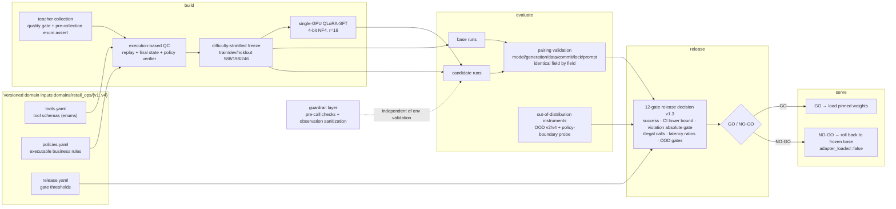

# RetailAgentOps

> **Status (2026-09-08): wrapped up, development paused.**
> The release candidate remains `sft-008` (historical decision, see below). The last three
> iterations each produced a `NO-GO` that precisely attributed and attempted to fix a new
> failure class: format slips → parser protocol tolerance (gate-verified), wording-domain
> lock-in → explicit word-domain coverage (OOD absolute gate recovered from 0.6833 to
> 0.8333), sealed-boundary wobble → recorded honestly. The single source of truth for
> per-observation decisions is [`docs/HOLDOUT_LEDGER.md`](docs/HOLDOUT_LEDGER.md)
> (Chinese; tables are numbers and readable regardless).

**Single-GPU domain adaptation and release pipeline for a retail tool agent** — it turns
tool schemas, business policies and tasks into executable trajectories, then runs the whole
chain: data QC → QLoRA post-training → execution-based evaluation → GO/NO-GO release
gating → inference serving, all on one consumer GPU.

**The exact verifiability boundary**: the CPU chain can be **reproduced by anyone who
clones this repo, with content hashes asserted** (one command, below). GPU-side numbers
(246-task sealed holdout, dev, out-of-distribution, policy-boundary probe) trace to a
`report_id` that is the full-field self-hash of that evidence — but **evidence files and
model weights are not distributed** (`reports/retail_ops/` and `models/` are gitignored;
see [`NOTICE.md`](./NOTICE.md)). In short: you can rerun the pipeline and the gates
yourself; you cannot replay my exact trajectories.

**One exception, and it is the most important one**: "training material and evaluation
material are disjoint" underpins every out-of-distribution claim. Both hash manifests
**are in Git**
([`manifests/retail_ops/v1/phrasing_exclusivity.json`](manifests/retail_ops/v1/phrasing_exclusivity.json)).
The empty intersection is **set arithmetic you can run yourself** — no trust required.
When private artifacts are present, another test pins "manifest == recomputed artifacts",
so the manifest cannot lie either.

[中文](./README.md) ｜ [Spec](./SPEC.md) ｜ [Model card](./docs/MODEL_CARD_sft-006.md) (historical
candidate card; the identity and failure modes of the final candidate `sft-008` are in the
[full results](./docs/RESULTS.md) and the [ledger](./docs/HOLDOUT_LEDGER.md)) ｜
[System card](./docs/SYSTEM_CARD.md) ｜ [Full results](./docs/RESULTS.md)

---

## The four things most worth looking at

**1. It separates "prompt engineering" credit from "post-training" credit.**
A 2×3 paired experiment (2 prompts × 3 capacity tiers: zero-training / attention-only /
full-linear; six runs, 60 frozen tasks per cell) shows they fix **different failures** with
almost no overlap: one explicit authorization line moved "knows it can refund but dare not
execute" from 5/10 to 9/10 while "retry after tool failure" **did not move**; post-training
moved retry from 5/10 to 10/10.

**2. It can reject its own candidates — and it did.**
The **first three release decisions on the sealed holdout were all `NO-GO`**. The hardest
one: the candidate scored **120/120** with **+14.2pp** success and zero policy violations
and zero illegal calls, and was rejected solely because p95 latency ratio 1.88 > 1.25.
Not one threshold changed (locked by tests). The fourth decision merged the LoRA **back
into the base weights** and re-measured: same weights, same behavior, same call counts,
p95 ratio **1.13** — the first automatic-gate **`GO`** in the project's history, followed
by the SPEC §6 item-6 **independent rebuild verification**.

**3. It built its own out-of-distribution set, cut a fresh GO in half — then fixed it and
paid the bill honestly.**
The same candidate scored only **0.5833** out of template, with the "rephrased request"
class at **0/20** — worse than the zero-trained base. **120/120 was not generalization**:
the frozen holdout shares its 12 request templates with training
([`docs/OOD_EVALUATION.md`](docs/OOD_EVALUATION.md)).
After diagnosing the mechanism (all 12 templates were formal imperative "please verify…"
sentences; the model had learned **surface form → action**) and augmenting training with
an LLM phrasing pool, the candidate scored **1.0000 and 0.9833** on two independently
generated sealed shards (zero-trained base: 0.7667 / 0.7333).
**The cost is stated too**: the model became more execution-happy — **2 and 7 policy
violations** on two same-config trainings, and the "cannot-do" class dropped 0.75 → 0.60.
See [`docs/GENERALIZATION_FIX.md`](docs/GENERALIZATION_FIX.md).

**4. The last three iterations: every `NO-GO` narrowed the failure surface by one class.**
One decision before these three shows the value of gates best: the first real decision
under the upgraded v1.3 twelve-gate schema (observation 7, 2026-09-06) took a reading
identical to the earlier GO (117/120, 2 policy violations, 0 illegal calls — a `GO` under
the v1.0/v1.1 schema) and rejected it on the new absolute safety gate. **The gates were
upgraded, so the verdict changed — that is the gates doing their job.**
v5 removed the training/holdout difficulty skew, and the absolute gate
`policy_violation_count_max = 0` **passed for the first time**; v6 fixed v5's only failing
gate (format slips → parser protocol tolerance, `invalid_call_count` → 0) and exposed that
the **"should-refuse" judgment was wording-domain locked** — near-perfect on the
same-source domain (0.9959) yet collapsed on the enum-word domain (probe deny side
0.00–0.107); v7 put that domain explicitly into training, **recovering the OOD absolute
gate `ood_task_success_min` from the observation-9 FAIL (0.6833) to 0.8333 (≥ 0.70) — the
same gate had passed at 0.9833/1.0000 in observations 7/8**, repairing the probe's
near boundary to ≥ 0.875 per point with zero over-correction — but the far side still
collapsed and the sealed face wobbled, so the preregistered rules said NO-GO.
**The value of gates is not adding points; it is exposing, round by round, the fragility
that same-source evaluation cannot see.**

> Quoting the GO without its OOD companion is forbidden — enforced by a test
> (`test_the_go_is_never_quoted_without_the_ood_reading`).

---

## Architecture



Artifacts flow one way and are never overwritten: `build` makes data → `evaluate` makes
evidence → `release` makes decisions → `serve` consumes decisions only. The dependency
direction is always `product_cli → retail_ops.* → core.*`, locked by governance tests.
Directory responsibilities: [`docs/REPO_MAP.md`](./docs/REPO_MAP.md) (Chinese).

### The five mechanisms that make results credible

| Mechanism | How |
|---|---|
| **Evidence cannot be forged** | A report's ID is the self-hash of **all its fields**; flipping one byte breaks loading (tamper-tested). There is also per-artifact SHA-256 binding — exercisable only when private artifacts are present; it **has been fully exercised** (including a one-byte edit to `trajectories.jsonl` being rejected), see [`REBUILD_VERIFICATION.md`](docs/REBUILD_VERIFICATION.md) |
| **Paired comparison has preconditions** | Model revision, generation params, dataset version, code commit, `uv.lock`, system-prompt hash must be **identical field by field**, otherwise pairing fails to load |
| **The holdout is sealed** | Two-stage authorization + five-way fingerprint isolation; every observation is recorded in [`HOLDOUT_LEDGER.md`](docs/HOLDOUT_LEDGER.md) (counts and decisions live there, not in this file), and **results never feed back into development, tuning, or candidate selection** |
| **OOD instruments are preregistered alongside the primary gates** | The OOD sets and the policy-boundary probe (15 offsets × wording domain) stand next to the twelve gates as preregistered conditions — three near-perfect same-source candidates were independently stopped by them |
| **Gates are versioned, never edited in place** | Gate IDs are frozen byte-for-byte (otherwise every existing release report stops loading); new semantics get a new version. Threshold changes so far: **0**, enforced by three machine layers |

---

## Key results

**Full detail in [`docs/RESULTS.md`](docs/RESULTS.md)** (incl. the v1.3 twelve-gate era;
where each number comes from, the ugly number next to it, and what it cannot support). The
single source of truth for
per-observation readings is [`docs/HOLDOUT_LEDGER.md`](docs/HOLDOUT_LEDGER.md).
Summary below — **every row carries its conditions**.

| Reading | Value | What must be said alongside |
|---|---|---|
| Sealed 120-task holdout, strongest candidate | **120/120** | The same candidate scored **0.5833** out of template, "rephrased" class **0/20** — worse than the zero-trained base. **120/120 was not generalization** |
| Release decisions (120-task era) | First three **NO-GO**, fourth **GO** | Losses: `success_delta` −0.0333, then latency `p95_latency_ratio` **1.8774 / 2.0250** (observations 2 and 3) at 120/120; the GO came from the **merged deployment form** of the same weights (ratio **1.1265**) — **attributed to deployment form, not the model** |
| Sealed 120-task holdout, final release candidate `sft-008` | **117/120** and **113/120** (two same-config runs) | Policy violations on the same two runs: **2 and 7**, all "refund past the deadline" — the cost and the fix came from the same change |
| Sealed OOD shards after generalization fix | **1.0000** and **0.9833** (two independent phrasing pools) | Zero-trained base on the second: **0.7333**; cost: **2 and 7 policy violations** on the sealed 120 across two same-config trainings, "cannot-do" class 0.75 → 0.60 |
| 246-task sealed holdout (difficulty-stratified era, round one) | candidate **1.0000** / violations **0** / illegal calls **2** | The violation absolute gate **passed for the first time** (confirming "5.0× difficulty skew caused violations"); the only failing gate was 2 format slips (0.8%) → **NO-GO (11/12)** |
| Same era, round two (after parser fix) | candidate **0.9959** / violations **1** / illegal calls **0** | Format gate zeroed (gate-level verification); **failure surface narrowed**: violation + OOD absolute gates both FAIL, exposing **wording-domain lock-in** of "should-refuse" (near-perfect same-source vs probe deny side 0.00–0.107) → **NO-GO (10/12)** |
| Same era, round three (after enum-word coverage; final decision) | candidate **0.9797** / violations **5** / illegal calls **0** | **`ood_task_success_min` recovered from the observation-9 FAIL (0.6833) to 0.8333 (≥ 0.70; observations 7/8 had passed it at 0.9833/1.0000)**; probe near boundary (−1..−5) repaired to ≥0.875 per point; zero damage on dev and probe allow side; far side (−7/−10/−14) still collapsed (0.250–0.625) + sealed-boundary wobble → **NO-GO (11/12) + probe condition FAIL** — coverage generalization is graded |
| Policy-boundary probe (15 offsets × wording domain, n=8 each) | Deny side 7 points **0.00–0.107** before → near boundary **≥0.875** after | n=8 gives ~±35pp CIs per point: **enough to see curve shape, not to rank single points** |
| dev 198 tasks (v5/v6 era) | base **0.5101 (v5) / 0.5404 (v6)** → candidates **0.9949–1.0000** | dev was used for candidate selection — **selection bias** |
| Independent rebuild verification (retrain with a different seed) | dev **58/60 – 60/60** (three same-config runs) | Zero-trained base **54/60**; same-seed reruns **do not produce bit-identical weights** (training is the only non-bitwise-reproducible stage), so no single point is quoted |
| Independent transfer check (hand-written, never used for selection) | 0.5833 → **0.8667** | The same change dropped `partial_refund` from 1.00 to 0.00 |
| Teacher data collection | Accept rate by batch: earlier two batches **87.9% / 99.2%**; v5 batch **96.3%**; v6 batch overall **579/588 = 98.5%** | Formal batch cost **~$0.0559** (with pre-collection enum assert, zero rework) |
| Engineering baseline | **1570 tests passed** (author machine, private artifacts present) | **1518 passed / 52 skipped / 0 failed on a clean clone** (re-verified at the wrap-up); skips all need artifacts not distributed with the repo. Ruff / `ruff format --check` / mypy / `uv lock --check` / public-release audit pass on both machines and CI |
| BFCL legacy track | **163/200** → **167/200** | A project-defined fixed single-turn AST subset; CI crosses 0; **not** the official full benchmark or a leaderboard result |

**How to read this table**: three `NO-GO`s are not failures — round one proved "difficulty
skew caused the violations", round two attributed the failure to a wording domain, round
three proved the "explicit word-domain coverage" prescription works on its target face
(OOD gate first pass, near boundary repaired, zero over-correction) while attributing the
remaining failure to the untargeted far-side combination and run variance. No threshold was
ever changed, and every failure appeared on **out-of-distribution instruments** — the
same-source evaluation face produced false perfect scores three times.

## Demo

A 70-second terminal demo (`docs/media/demo.mp4`): four interfaces, CPU full-chain
reproduction, **the gate actually rejecting a bad candidate**, and the OOD reading that cut
the GO in half.

**Every line in the video is a real run**: `scripts/ops/capture_demo_transcript.py` runs
real commands and saves a transcript; `scripts/ops/render_demo_video.py` **only reads the
transcript and executes nothing** (a test asserts it calls ffmpeg exactly once). The two
steps are separate so the render stage has no chance to add anything.

```bash
.venv/bin/python scripts/ops/capture_demo_transcript.py --output /tmp/demo.json
# Rendering needs Pillow in a separate venv — the project's uv.lock is untouched
<demo-venv>/bin/python scripts/ops/render_demo_video.py --transcript /tmp/demo.json --output docs/media/demo.mp4
```

## Quick start

```bash
# 1. Install (frozen lock)
env -u UV_INDEX_URL uv sync --extra dev --frozen

# 2. Run the whole CPU chain in one command and assert hashes equal frozen expectations
.venv/bin/python scripts/ci/verify_qualification_chain.py
```

Step 2 is the automated proof of `SPEC.md` §11 ("a fresh environment can complete the CPU
smoke per the docs"): it runs `build → evaluate ×3 → release ×2`, then asserts both
`release.json` files' decisions, failing gates, `bundle_sha256` / `task_manifest_sha256`
and deterministic metrics **equal the frozen expectations** — not "exit code 0",
content-hash equality.

### Quality gates

```bash
.venv/bin/pytest -q
.venv/bin/ruff check . && .venv/bin/ruff format --check .
.venv/bin/mypy
env -u UV_INDEX_URL -u UV_DEFAULT_INDEX uv lock --check
.venv/bin/python scripts/ci/audit_public_release.py
```

GitHub Actions: [`.github/workflows/ci.yml`](.github/workflows/ci.yml) — CI runs the CPU
chain and the public-release audit only（不含 GPU / API 采集）.

A CPU-only image is in [`Dockerfile`](./Dockerfile) (torch deliberately excluded). It was
**actually built and verified on 2026-08-16**: 1.05 GB, and the full chain passed under
`--network none` — stronger than CI, because it proves "a clean environment with no network
still reproduces and asserts content hashes".

```bash
docker build -t retail-agent-ops:cpu .
docker run --rm --network none retail-agent-ops:cpu
```

### Running the qualification chain manually

Output directories are non-overwritable; swap `qualification-r1-final` for a fresh name to
re-run.

```bash
R=reports/retail_ops/v1/qualification-r1-final
.venv/bin/retail-agent-ops build    --config configs/retail_ops/build/retail_ops_v1_build.yaml --seed 0 --output_dir $R/build
.venv/bin/retail-agent-ops evaluate --config configs/retail_ops/evaluate/retail_ops_v1_qualification_base.yaml   --seed 0 --input_dir $R/build --output_dir $R/base
.venv/bin/retail-agent-ops evaluate --config configs/retail_ops/evaluate/retail_ops_v1_qualification_oracle.yaml --seed 0 --input_dir $R/build --output_dir $R/oracle
.venv/bin/retail-agent-ops evaluate --config configs/retail_ops/evaluate/retail_ops_v1_qualification_fault.yaml  --seed 0 --input_dir $R/build --output_dir $R/fault
.venv/bin/retail-agent-ops release  --config configs/retail_ops/release/retail_ops_v1_release.yaml --seed 0 --baseline_dir $R/base --candidate_dir $R/oracle --output_dir $R/release-go
.venv/bin/retail-agent-ops release  --config configs/retail_ops/release/retail_ops_v1_release.yaml --seed 0 --baseline_dir $R/base --candidate_dir $R/fault  --output_dir $R/release-no-go
.venv/bin/retail-agent-ops serve    --config configs/retail_ops/serve/retail_ops_v1_serve.yaml --release_dir $R/release-go --input_dir $R/build --output_dir $R/service
```

This data is a synthetic qualification set for verifying the **engineering contracts**;
R1 never generated a formal holdout nor read holdout ground truth. BFCL remains an
independent external regression; its scores are not RetailOps internal metrics.

### Tool-schema robustness side-by-side

`perturb_schema` renames tool aliases and shuffles parameter order (same key sets); two
configs differing by one switch answer "does it still work with a customer's own schema":
the shape-parsing `schema_adaptive` strategy scores 12/12 on both sides, while the
hard-coded-name `oracle` policy is **wiped out** under perturbation (locked by tests).
Pure CPU, pure rules, no model.

---

## Repository layout

```
src/veritool_rl/
├── product_cli.py    four-interface command surface
├── core/             cross-domain infrastructure (trajectory contracts, env abstraction, agent loop, metrics, artifact hashing, cross-domain teacher)
├── retail_ops/       RetailOps domain: domain / build / evaluate / release / serve
├── flight_ops/       second domain (R8), mirrors the four interfaces, proves domain swappability
├── training/         single-GPU QLoRA-SFT
└── legacy/           the original VeriTool-RL line (BFCL external regression still uses it)
configs/retail_ops/{build,evaluate,release,serve}/   one config per command
domains/retail_ops/{v1..v4}/                         tool schemas, business policies, release policies (v1 frozen; v2 executable rules; v3 15 tools; v4 cross-tool)
```

The distribution/CLI name is `retail-agent-ops`; the Python import name remains
`veritool_rl` (historical; see [`docs/REPO_MAP.md`](./docs/REPO_MAP.md), Chinese).

---

## Result boundaries (must be said together)

- **The candidate is not "ready to ship."** The historical **automatic-gate GO** (per-decision
  ledger: [`docs/HOLDOUT_LEDGER.md`](docs/HOLDOUT_LEDGER.md)) and the independent rebuild
  verification ([`docs/REBUILD_VERIFICATION.md`](docs/REBUILD_VERIFICATION.md)) prove the
  process works, not generalisation: the task set is synthetic, 2–5 tools / 12 classes /
  one Chinese retail-refund scenario, and `ci95` degenerates to [1.0, 1.0] at a perfect
  score — that is not significance. **The same historical candidate scored 0.5833 out of
  template, "rephrased" 0/20**; the fixed candidate still had **2–7 policy violations** on
  the sealed set (two same-config trainings).
  **The gates compare against base, so a candidate with more violations can still pass —
  that is not production readiness.**
- **The final release candidate is `sft-008`**: the last decision was `NO-GO`
  (11/12 + probe condition FAIL) and the candidate was not swapped. 11 of 12 gates pass
  and the OOD absolute gate recovered to 0.8333 from the observation-9 FAIL (0.6833) —
  **the remaining gap is precisely attributed** (probe far-side mechanism undetermined; sealed-boundary wobble is run
  variance) — but by preregistered rules, one gate short means one gate short.
- **dev readings carry selection bias**: dev was used to pick the candidate; holdout
  necessarily regresses.
- **Latency numbers are not comparable across runs**: the GPU is shared, co-tenant usage
  swung 0%–98%; the gates use within-run **ratios**.
- **`verifier_reward` moved against the primary metric four times** and is demoted to a
  diagnostic. The primary metrics are final state and the policy verifier only.
- **BFCL scores are a legacy track**: Qwen3-1.7B fixed 200-task single-turn AST subset,
  Base/SFT 163/200 and 167/200, CI crosses 0, **not** an official BFCL score or a
  leaderboard result.
- No papers; no SOTA/ablation-count/three-seed completion criteria.

**If those numbers look suspicious** (120/120, three metrics zeroed at once, 98.5% on the
v6 batch), that
is the right reaction — [`docs/READING_THE_NUMBERS.md`](docs/READING_THE_NUMBERS.md)
explains, number by number, **why they are achievable**, **what the ugly number next door
is**, and **what conclusions they cannot support**.

Failure coverage and explicitly-untackled items: [`docs/FAULT_MATRIX.md`](docs/FAULT_MATRIX.md)
(five fault classes → concrete tests).

---

## Document index

| Doc | Content |
|---|---|
| [`SPEC.md`](./SPEC.md) | product contract, metrics, release gates, acceptance principles |
| [`docs/EXECUTION_PLAN.md`](docs/EXECUTION_PLAN.md) | phase status (single source of truth; R0–R10 + v5–v7 iterations; Chinese) |
| [`docs/RESULTS.md`](docs/RESULTS.md) | **full key results**: provenance, the ugly neighbor, non-supports |
| [`docs/HOLDOUT_LEDGER.md`](docs/HOLDOUT_LEDGER.md) | sealed-holdout observation ledger (single source of truth for decisions) |
| [`docs/PITFALLS.md`](docs/PITFALLS.md) | 27 pitfalls + a falsified-directions table with attribution |
| [`docs/READING_THE_NUMBERS.md`](docs/READING_THE_NUMBERS.md) | for skeptics: mechanism, ugly neighbor, non-supports |
| [`docs/MODEL_CARD_sft-006.md`](docs/MODEL_CARD_sft-006.md) | model card of the 120/120 candidate |
| [`docs/MODEL_CARD.md`](docs/MODEL_CARD.md) | earlier candidate model card |
| [`docs/SYSTEM_CARD.md`](docs/SYSTEM_CARD.md) | system boundary, safety, failure modes |
| [`docs/OOD_EVALUATION.md`](docs/OOD_EVALUATION.md) | OOD task set v1 and readings (now an independent transfer check) |
| [`docs/OOD_SEALED_LEDGER.md`](docs/OOD_SEALED_LEDGER.md) | sealed OOD shard ledger |
| [`docs/GENERALIZATION_FIX.md`](docs/GENERALIZATION_FIX.md) | **generalization fix**: diagnosis, phrasing pool, sealed-shard decisions and cost |
| [`docs/POLICY_BOUNDARY.md`](docs/POLICY_BOUNDARY.md) | policy-boundary probe: localizing "should-refuse-but-executed", and a repair judged by preregistered rules |
| [`docs/REBUILD_VERIFICATION.md`](docs/REBUILD_VERIFICATION.md) | independent rebuild verification (SPEC §6 item 6; quantified training non-reproducibility) |
| [`docs/GATE_SCHEMA_V11_RECOMPUTE.md`](docs/GATE_SCHEMA_V11_RECOMPUTE.md) | deployment-form attribution: one weight, two loadings, recomputed gates |
| [`docs/SERVING_FORM_COMPARISON.md`](docs/SERVING_FORM_COMPARISON.md) | four-way throughput comparison of serving forms/engines |
| [`docs/ENGINE_SUBSTITUTION.md`](docs/ENGINE_SUBSTITUTION.md) | vLLM behavioral consistency through the full evaluate path |
| [`docs/AGENT_LOOP.md`](docs/AGENT_LOOP.md) | agent loop, user simulator, multi-turn clarification |
| [`docs/DOMAIN_BUNDLE_V2.md`](docs/DOMAIN_BUNDLE_V2.md) | policy externalization, idempotency keys, guardrails |
| [`docs/FAULT_MATRIX.md`](docs/FAULT_MATRIX.md) | five fault classes → concrete tests |
| [`docs/R8_DIAGNOSIS.md`](docs/R8_DIAGNOSIS.md) | three root causes of poor OOD generalization; degradation-rig lessons |
| [`docs/R9_PHASE_B_RESULTS.md`](docs/R9_PHASE_B_RESULTS.md) | data-diversity expansion: 5 tools / 12 scenarios, readings and boundaries |
| [`docs/MLOPS_COMPARISON.md`](docs/MLOPS_COMPARISON.md) | comparison with generic MLOps pipelines |
| [`docs/TOOLFACE_MIGRATION_ANALYSIS_E1.md`](docs/TOOLFACE_MIGRATION_ANALYSIS_E1.md) | tool-face migration analysis |
| [`docs/CI_EVIDENCE.md`](docs/CI_EVIDENCE.md) | first real CI run evidence |
| [`docs/DEMO.md`](docs/DEMO.md) | demo walkthrough |
| [`docs/adr/`](docs/adr/) | architecture decision records |
| [`NOTICE.md`](./NOTICE.md) | third-party components, distribution boundary (incl. **document tiers**), benchmark claim boundaries |

**Note**: an additional layer of **author-local working documents** (job-hunting material
and agent ops memory) is not distributed with the repo; the list and rationale are in
[`NOTICE.md`](./NOTICE.md) ("document tiers"). No engineering conclusion is lost — they are
all carried by the public documents above.

## License

MIT, see [`LICENSE`](./LICENSE). Model weights, training data, holdout ground truth and
run artifacts are **not distributed**; boundaries and enforcement are in
[`NOTICE.md`](./NOTICE.md).
