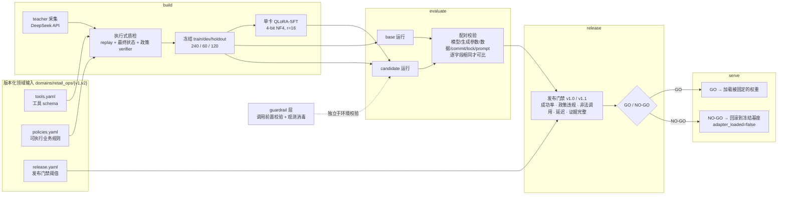

# RetailAgentOps

**零售工具 Agent 的单卡领域适配与发布流水线**——把工具 schema、业务政策和任务变成可执行
轨迹，走完数据质检 → QLoRA 后训练 → 执行式评测 → GO/NO-GO 发布门禁 → 推理服务，
全程在一张消费级显卡上。

**可验证性的准确边界**：CPU 全链路**任何人 clone 下来就能复现并断言内容哈希**（一条命令，见下）。GPU 侧的数字（120 条 holdout、dev、分布外）追溯到运行证据的 `run_id`——那是该份证据全字段的自哈希，但**证据文件与模型权重不随仓库分发**（`reports/retail_ops/` 与 `models/` 均 gitignore，理由见 [`NOTICE.md`](./NOTICE.md)）。换句话说：链路和门禁你能自己跑，我这一次跑出来的具体轨迹你不能重放。

[English](./README.en.md) ｜ [产品规格](./SPEC.md) ｜ [模型卡](./docs/MODEL_CARD_sft-006.md) ｜
[系统卡](./docs/SYSTEM_CARD.md) ｜ [面试材料](./docs/INTERVIEW_PREP.md)

---

## 这个项目最值得看的三件事

**1. 它把「提示词工程」和「后训练」的功劳分开了。**
2×3 配对实验（2 种 prompt × 3 档容量：零训练 / attention-only / 全 linear，六次运行、每格 60 条冻结任务）证明
两者修的是**不同的失败**，几乎不重叠：一句显式授权指令把"判定可退却不敢执行"从
5/10 提到 9/10，而"工具失败后重试"**零变化**；后训练把重试类 5/10 打到 10/10。

**2. 它能拒绝自己的候选，也真的拒绝了三次。**
封存 holdout 的五次观测里前三次都是 `NO-GO`。最难的一次：候选做到 **120/120**、
成功率 **+14.2pp**、政策违规与非法调用全部清零，只因 p95 延迟比值 1.88 > 1.25 被拒。
阈值一个字未改（有测试锁定）。第四次把 LoRA **合并回基座权重**后重测——同一份权重、
同一套行为、调用次数一模一样，p95 比值 **1.13**，拿到项目历史上第一个自动门禁 **`GO`**，
并已通过 SPEC §6 第 6 条的**独立重建复验**。

**3. 它自己建了一个分布外集合，把刚拿到的 GO 打掉了一半——然后把它修好了，并算清了账单。**
同一个候选在模板外只有 **0.5833**，"换个说法"这一类 **0/20**、比零训练基座还差。
**120/120 不是泛化**——冻结 holdout 与训练集共用同一批请求模板
（[`docs/OOD_EVALUATION.md`](docs/OOD_EVALUATION.md)）。

诊断到机制（12 句模板全是"请核实…"的书面祈使句，模型学的是**表面形式 → 动作**），
用 LLM 措辞池做训练增强后，在一个**只观测一次的封存分片**上从 0.7333 到 **1.0000**，
在一个**作者手写、从未用于选择**的独立集合上 `expression_ood` **0.00 → 1.00**。
**代价同样具体**：模型变得更倾向执行，dev 上多了 2 次政策违规、
"做不到的请求"一类从 0.75 掉到 0.60。见
[`docs/GENERALIZATION_FIX.md`](docs/GENERALIZATION_FIX.md)。

> 引用那个 GO 时必须同时给出分布外读数——这一点由测试强制
> （`test_the_go_is_never_quoted_without_the_ood_reading`）。

---

## 架构



四个接口的产物是**单向、不可覆盖**的：`build` 产数据 → `evaluate` 产证据 → `release`
产判定 → `serve` 只消费判定。依赖方向恒为 `product_cli → retail_ops.* → core.*`，
由治理测试锁定。目录职责见 [`docs/REPO_MAP.md`](./docs/REPO_MAP.md)。

### 让结果可信的四个机制

| 机制 | 做法 |
|---|---|
| **运行证据不可伪造** | 运行报告的 ID 是它自己**全部字段**的自哈希，改一字节即加载失败（已做篡改测试）。另有**逐产物 SHA-256 绑定**——但它只能在私有产物在场时行使，而私有产物不随仓库分发；2026-08-16 已在本地对 R5 两次重建**完整行使过一次**（含改 `trajectories.jsonl` 一个字节被拒），见 [`REBUILD_VERIFICATION.md`](docs/REBUILD_VERIFICATION.md) |
| **配对比较有前置条件** | 模型 revision、生成参数、数据集版本、code commit、`uv.lock`、system prompt 哈希**逐字段相同**才允许配对，否则加载失败 |
| **holdout 是封存的** | 两段式授权门 + 五维指纹隔离；整个开发期只观测四次，逐次记在 [`HOLDOUT_LEDGER.md`](docs/HOLDOUT_LEDGER.md) |
| **门禁可以版本化但不可就地改** | `GATE_IDS` v1.0 逐字节冻结（否则磁盘上已有 release 报告全部无法加载），新口径走 v1.1；两套并存 |

---

## 关键结果

> 观测次数与逐次读数的唯一事实源是 [`docs/HOLDOUT_LEDGER.md`](docs/HOLDOUT_LEDGER.md)；
> 简历取数口径见 [`docs/RESUME_EVIDENCE.md`](docs/RESUME_EVIDENCE.md)。本节是摘录。

### 封存 120 条 holdout（Qwen3-4B）

| 观测 | 候选 | task_success | 政策违规 | 非法调用 | p95 比值 | 判定 |
|---|---|---|---|---|---|---|
| 1（2026-08-11） | R3，attention-only | 0.7500（90/120） | 16 → **0** | 41 → **0** | 1.0870 | **NO-GO**（`success_delta` −0.0333） |
| 2（2026-08-14） | R4 `sft-006`，全 linear | **1.0000（120/120）** | 11 → **0** | 5 → **0** | **1.8774** | **NO-GO**（延迟） |
| 3（2026-08-15） | 同上，代码冻结后复现 | **1.0000**（逐位相同） | 0 | 0 | 2.0250 | **NO-GO**（延迟） |
| 4（2026-08-15） | **同一份权重，合并进基座** | **1.0000** | 0 | 0 | **1.1265** | **`GO` / candidate（merged）** |

**GO 归因于部署形态，不是模型**：未合并候选对同一份 base 重算仍是 1.9219 FAIL。
延迟代价已拆开——调用次数只增 14.6%，**单次调用耗时 1497 → 2971 ms（1.985×）**，
来自全 linear LoRA 的前向开销。

### dev 60 条：prompt × 容量 × 模型规模

| | 零训练 | attention-only | 全 linear layer |
|---|---|---|---|
| **Qwen3-4B**，原 prompt | 48/60 | 45/60 | **60/60** |
| **Qwen3-4B**，新 prompt | 54/60 | 55/60 | **60/60** |
| **Qwen3-1.7B**，新 prompt | 44/60 | **58/60** | 45/60 |

**1.7B 上方向相反**：全 linear 的 15 条失败**全部**是"该拒绝却没拒绝"
（`refund_denied_ownership` 10/10 全灭，`average_tool_calls` 1.27→2.08）——
容量过剩被训练数据 2:1 的执行偏向带跑。**结论是容量必须与规模匹配，不存在"越大越好"**，
且数据配比与容量**耦合**，不能当作两个独立旋钮。

### 分布外 60 条：120/120 不是泛化

| | 零训练基座 | 拿到 GO 的合并版候选 |
|---|---|---|
| 封存 holdout（模板内） | 0.8583 | **1.0000** |
| **分布外（模板外）** | **0.2167** | **0.5833** |
| `expression_ood`（口语/错别字/中英夹杂/极简） | 0.30 | **0.00** |
| `scenario_ood`（做不到的请求 + 多实体） | 0.00 | **0.75** |
| `adversarial`（错订单号/脏字段/工具诱导） | 0.35 | **1.00** |

### 泛化修复：对未见过的措辞更鲁棒了，以及它的账单

诊断出「表面形式 → 动作」的捷径后，用 LLM 生成的措辞池做训练增强
（只改 user 第一句话，工具调用与目标状态一个字不动）。措辞按
`sha256(措辞+固定盐)` **确定性三分**，训练用的与评测用的**逐条互斥**（ADR 0005）——
不是构造上应该互斥，而是**直接读真实训练文件比对过**：训练分片的 147 条里
142 条确实进了 `sft.jsonl`，评测分片的 **0 条**进了。

**封存分片（只观测一次，代码冻结后跑）**，状态空间与冻结契约同宽：

| 运行 | 总计 | `eligible` | `recovery` | 三个拒绝类 | 政策违规 |
|---|---|---|---|---|---|
| 零训练基座 | 0.7667 | 0.20 | 1.00 | 0.90 / 0.90 / 1.00 | 1 |
| 旧候选 `sft-006` | **0.7167** | **0.00** | **0.30** | 1.00 ×3 | 0 |
| **新候选 `sft-008`** | **1.0000** | 1.00 | 1.00 | 1.00 ×3 | **0** |

旧候选**低于零训练基座**——这正是要修的那件事。

**独立迁移检查**（OOD v1：作者手写、生成过程完全不同、**从未用于选择**）：
`expression_ood` **0.00 → 1.00**（20 条 = 五子类 × n=4），总分 0.5833 → **0.8667**。

**账单**：模型变得更倾向执行，于是「不该动手时也动手」——dev 上新增 **2 次政策违规**，
封存 holdout 上 117/120（旧候选是 120/120）且同样有 2 次违规，
OOD v1 的 `scenario_ood` 从 0.75 掉到 **0.60**（`partial_refund` 1.00 → **0.00**）。
收益与代价来自同一个改动。

**一个必须说的更正**：这个封存分片的**第一版是有缺陷的**——它的状态空间比训练/dev 更窄
（1 个订单 vs 1–5、1 种期限余量 vs 7、3 种订单状态 vs 7），也就是更容易，
而文档写着「唯一自变量是说法」。**这是外部审阅发现的，不是我自己发现的。**
修正后换一份**全新措辞池**重测才有上表；旧分片退役，其唯一一次读数保留在
[`docs/OOD_SEALED_LEDGER.md`](docs/OOD_SEALED_LEDGER.md)。

详见 [`docs/GENERALIZATION_FIX.md`](docs/GENERALIZATION_FIX.md)。

### 它也通过了发布门禁（第五次、也是最后一次封存 holdout 观测）

| 门禁 | v1.0 | v1.1 |
|---|---|---|
| `success_delta` | PASS +0.1167 | PASS +0.1167 |
| `success_delta_ci_lower` | — | **PASS +0.0583** |
| `policy_violation_delta` | PASS −9 | PASS −9 |
| `invalid_call_count` | PASS 0 | PASS 0 |
| `p95_latency_ratio` | **PASS 1.0203** | 已拆分为三项，全 PASS |
| **判定** | **GO / candidate** | **GO / candidate** |

**候选在 120 条上不是满分**：117/120 且有 2 次政策违规（`sft-006` 那次是 120/120、0 违规）。
**这是同一个代价在模板内的体现。** 另外 base 侧 p95 这次比第四次慢 6%，
而门禁是比值——**一个更慢的 base 等于给候选放宽了门禁**，这一条必须一起说。

### 独立重建复验（SPEC §6 第 6 条）

同一份配置、同一份数据、同一个基座、同一组超参，**只换 `--seed`** 重训两次，
再对同一份 base 证据做配对评测：

| 运行 | seed | dev task_success | 政策违规 |
|---|---|---|---|
| `base-002`（零训练） | — | 0.9000（54/60） | 5 |
| 原候选 `sft-006` | 0 | 1.0000（**60/60**） | **0** |
| **重建 A** | **0（同 seed）** | 0.9667（**58/60**） | **0** |
| **重建 B** | 1 | 1.0000（**60/60**） | **0** |

第 6 条满足——两次重建都高于零训练基座，政策违规三次都清零。
**但同 seed 产不出同一份权重**（训练代码自 2026-08-09 零改动、数据哈希一致、
解析后配置只差两行输出路径）。所以 **「60/60」不是常数**，它有 ±2 的运行间波动，
而波动**全部**落在 `refund_recovery`——正是后训练独占贡献的那一类。
**训练是本项目唯一不能逐位复现的环节。**
详见 [`docs/REBUILD_VERIFICATION.md`](docs/REBUILD_VERIFICATION.md)。

### 工程与资源

| 项 | 值 |
|---|---|
| teacher 采集（**两批，别把两批的数字混着引用**） | 批次 1 `teacher-smoke-001`：519 次请求 / **$0.055** / 211-240 = **87.9%**（环境缺陷修复前）；批次 2 `teacher-full-001`：526 次 / **$0.0559** / **238/240 = 99.2%**（修复后，正式训练数据来源）。**合计 1045 次请求、约 $0.111** |
| QLoRA 训练（全 linear，`sft-006` 配置的**三次**运行） | 单卡 3 epoch / 75 steps。时长 `sft-006` **293.7 s** / 重建 A **242.3 s** / 重建 B **242.2 s**（差异是共享 GPU 上他人占用，**不是配置差异**）；三次 `cuda_peak_allocated` 均 **5.65 GB**；adapter 三次**逐字节同尺寸** **66,127,776 B（63 MiB）** |
| 评测推理峰值显存 | 4-bit NF4，**2.95–3.04 GB** |
| serving 四档吞吐 | 合并 + vLLM 相对当前服务栈 **3.32×**，且是**乘性两段**：去掉 NF4 得 1.64×（不需新依赖），再换引擎得 2.02×（[详情](docs/SERVING_FORM_COMPARISON.md)） |
| 工程基线 | **1066 tests passed**；Ruff / `ruff format --check` / mypy(86 源文件) / `uv lock --check` / 公开发布审计全绿 |

---

## 演示

70 秒的终端演示（`docs/media/demo.mp4`）：四个接口、CPU 全链路复现、**门禁真的拒绝了
一个坏候选**、以及那个 GO 旁边把它打掉一半的分布外读数。

**视频里每一行输出都是真跑出来的**：`scripts/ops/capture_demo_transcript.py` 执行真实命令
并存下 transcript，`scripts/ops/render_demo_video.py` **只读 transcript、不执行任何命令**
（有测试断言它只调用一次 ffmpeg）。两步分开就是为了让渲染阶段没有机会往里加东西。

```bash
.venv/bin/python scripts/ops/capture_demo_transcript.py --output /tmp/demo.json
# 渲染需要 Pillow，装在独立 venv 即可——项目 uv.lock 一个字节不动
<demo-venv>/bin/python scripts/ops/render_demo_video.py --transcript /tmp/demo.json --output docs/media/demo.mp4
```

## 快速开始

```bash
# 1. 装依赖（冻结 lock）
env -u UV_INDEX_URL uv sync --extra dev --frozen

# 2. 一条命令跑完 CPU 全链路并断言结果等于冻结期望值
.venv/bin/python scripts/ci/verify_qualification_chain.py
```

第 2 步就是 `SPEC.md` §11「新环境能按文档完成 CPU smoke」的自动化证明：它跑
`build → evaluate ×3 → release ×2`，然后断言两份 `release.json` 的决策、失败门禁、
`bundle_sha256` / `task_manifest_sha256` 与确定性指标**等于冻结期望值**——
不是"退出码为 0"，是内容哈希相等。

### 质量门

```bash
.venv/bin/pytest -q
.venv/bin/ruff check . && .venv/bin/ruff format --check .
.venv/bin/mypy
env -u UV_INDEX_URL -u UV_DEFAULT_INDEX uv lock --check
.venv/bin/python scripts/ci/audit_public_release.py
```

GitHub Actions workflow 见 [`.github/workflows/ci.yml`](.github/workflows/ci.yml)。
**仓库当前无 remote，该 workflow 从未真正跑过**——任何文档都不得声称它跑绿了。

CPU-only 镜像见 [`Dockerfile`](./Dockerfile)（刻意不含 torch）。**它于 2026-08-16
首次实际构建并验证过**：镜像 1.05 GB，在 `--network none`（完全断网）下跑通全链路——
这比 workflow 更强，因为它证明的是"一个干净环境、没有网络，也能复现并断言内容哈希"。

```bash
docker build -t retail-agent-ops:cpu .
docker run --rm --network none retail-agent-ops:cpu
```

### 手动跑 qualification 链路

输出目录是不可覆盖语义；重复验收时把 `qualification-r1-final` 整体换成新名字。

```bash
R=reports/retail_ops/v1/qualification-r1-final
.venv/bin/retail-agent-ops build    --config configs/retail_ops/build/retail_ops_v1_build.yaml --seed 0 --output_dir $R/build
.venv/bin/retail-agent-ops evaluate --config configs/retail_ops/evaluate/retail_ops_v1_qualification_base.yaml   --seed 0 --input_dir $R/build --output_dir $R/base
.venv/bin/retail-agent-ops evaluate --config configs/retail_ops/evaluate/retail_ops_v1_qualification_oracle.yaml --seed 0 --input_dir $R/build --output_dir $R/oracle
.venv/bin/retail-agent-ops evaluate --config configs/retail_ops/evaluate/retail_ops_v1_qualification_fault.yaml  --seed 0 --input_dir $R/build --output_dir $R/fault
.venv/bin/retail-agent-ops release  --config configs/retail_ops/release/retail_ops_v1_release.yaml --seed 0 --baseline_dir $R/base --candidate_dir $R/oracle --output_dir $R/release-go
.venv/bin/retail-agent-ops release  --config configs/retail_ops/release/retail_ops_v1_release.yaml --seed 0 --baseline_dir $R/base --candidate_dir $R/fault  --output_dir $R/release-no-go
.venv/bin/retail-agent-ops serve    --config configs/retail_ops/serve/retail_ops_v1_serve.yaml --release_dir $R/release-go --input_dir $R/build --output_dir $R/service
```

这套数据是用于验证**工程契约**的合成 qualification；R1 未生成正式 holdout，也没有读取
holdout 真值。BFCL 只保留为独立外部回归，现有 BFCL 成绩不是 RetailOps 内部指标。

### 工具 schema 鲁棒性对照

`perturb_schema` 给工具改别名并打乱参数顺序（键集合不变），两份只差一个开关的配置
回答"换一份客户的工具 schema 还能不能用"：按参数形状解析工具名的 `schema_adaptive`
策略两侧都是 12/12，把 `policy_type` 换成硬编码工具名的 `oracle` 在扰动侧**全灭**
（测试锁定这个对照）。纯 CPU、纯规则、不涉及模型。

---

## 仓库结构

```
src/veritool_rl/
├── product_cli.py    四接口命令面
├── core/             跨领域基础设施（轨迹契约、环境抽象、agent 执行、指标、产物哈希）
├── retail_ops/       RetailOps 领域：domain / build / evaluate / release / serve
├── training/         单卡 QLoRA-SFT
└── legacy/           原 VeriTool-RL 路线（BFCL 外部回归仍在用）
configs/retail_ops/{build,evaluate,release,serve}/   与命令一一对应的运行配置
domains/retail_ops/{v1,v2}/                          工具 schema、业务政策、发布策略
```

分发名与 CLI 是 `retail-agent-ops`，Python 导入名仍是 `veritool_rl`（历史原因，
命名边界见 [`docs/REPO_MAP.md`](./docs/REPO_MAP.md)）。

---

## 结果边界（必须一起说的话）

- **候选没有"可以上线"。** 第四次是**自动门禁 GO**，SPEC §6 第 6 条的独立重建复验
  已完成（[`docs/REBUILD_VERIFICATION.md`](docs/REBUILD_VERIFICATION.md)），
  但任务集是 2 工具 / 6 类 / 单一中文零售退款场景，每类 20 条，`ci95` 在满分时是
  [1.0, 1.0] 的退化区间——那不是显著性证据。
- **通过门禁的是合并部署形态**，不是前三次被拒的那个形态。两者是同一份权重的两种加载方式。
- **合并形态的门禁余量只有 1–3%**，而 base 侧 p95 在两次观测间有 9% 的波动——
  不得表述为"延迟问题已解决"。
- **dev 的读数带选择偏差**：dev 已被用于从多个候选中选出这一个，holdout 必然回落。
- **延迟数不可跨运行比较**：GPU 共享，各次运行他人占用 0%–98% 不等。门禁用的是同一次
  运行内的**比值**。
- **`verifier_reward` 四次与主判据反向**，现已降级为诊断量。主判据只有最终状态与政策
  verifier。
- **BFCL 成绩属 legacy 轨道**：Qwen3-1.7B 固定 200 条单轮 AST 子集 Base/SFT 为
  163/200 与 167/200，差值置信区间跨 0，**不是**官方 BFCL 全量或排行榜成绩。
- 不产出论文，不以 SOTA、ablation 数量或三 seed 作为完成标准。

**如果你觉得这里几个数高得可疑**（120/120、三项指标同时为 0、99.2%），
那是对的反应——[`docs/READING_THE_NUMBERS.md`](docs/READING_THE_NUMBERS.md)
逐个说明它们**为什么可能达到**、**旁边那个不好看的数是多少**、以及**不能支持什么结论**。

完整的「不可写表述」清单在 [`docs/RESUME_EVIDENCE.md`](docs/RESUME_EVIDENCE.md) §2。
故障覆盖与明确没做的项见 [`docs/FAULT_MATRIX.md`](docs/FAULT_MATRIX.md)。

---

## 文档索引

| 文档 | 内容 |
|---|---|
| [`SPEC.md`](./SPEC.md) | 产品契约、指标、发布门禁、验收原则 |
| [`docs/EXECUTION_PLAN.md`](docs/EXECUTION_PLAN.md) | R0–R5 阶段状态（唯一事实源） |
| [`docs/HOLDOUT_LEDGER.md`](docs/HOLDOUT_LEDGER.md) | 封存 holdout 观测台账（唯一事实源） |
| [`docs/MODEL_CARD_sft-006.md`](docs/MODEL_CARD_sft-006.md) | 最强候选的模型卡 |
| [`docs/SYSTEM_CARD.md`](docs/SYSTEM_CARD.md) | 系统边界、安全与失败模式 |
| [`docs/OOD_EVALUATION.md`](docs/OOD_EVALUATION.md) | 分布外任务集 v1 与读数（现为独立迁移检查） |
| [`docs/GENERALIZATION_FIX.md`](docs/GENERALIZATION_FIX.md) | **泛化修复**：诊断、措辞池、封存分片判定与代价 |
| [`docs/REBUILD_VERIFICATION.md`](docs/REBUILD_VERIFICATION.md) | 独立重建复验（SPEC §6 第 6 条） |
| [`docs/SERVING_FORM_COMPARISON.md`](docs/SERVING_FORM_COMPARISON.md) | 部署形态与引擎的四档吞吐对照 |
| [`docs/ENGINE_SUBSTITUTION.md`](docs/ENGINE_SUBSTITUTION.md) | vLLM 走完整 evaluate 路径的行为一致性 |
| [`docs/AGENT_LOOP.md`](docs/AGENT_LOOP.md) | Agent 循环、user simulator 与多轮澄清 |
| [`docs/DOMAIN_BUNDLE_V2.md`](docs/DOMAIN_BUNDLE_V2.md) | 政策外置、幂等键、guardrail |
| [`docs/FAULT_MATRIX.md`](docs/FAULT_MATRIX.md) | 五类故障 → 具体测试的映射 |
| [`docs/READING_THE_NUMBERS.md`](docs/READING_THE_NUMBERS.md) | 面向怀疑者：每个高分的机制、它旁边不好看的数、它不能支持什么 |
| [`docs/RESUME_EVIDENCE.md`](docs/RESUME_EVIDENCE.md) | 简历取数口径与不可写表述 |
| [`docs/INTERVIEW_PREP.md`](docs/INTERVIEW_PREP.md) | 五分钟讲解、深挖问答、失败案例库 |
| [`docs/DEMO.md`](docs/DEMO.md) | 演示流程 |
| [`docs/PROJECT_LOG.md`](docs/PROJECT_LOG.md) | append-only 长期档案（只记改变做法的事件） |
| [`NOTICE.md`](./NOTICE.md) | 第三方组件、分发边界、benchmark 声明边界 |

面向 coding agent 的工程协议见 [`AGENTS.md`](./AGENTS.md) 与 [`CLAUDE.md`](./CLAUDE.md)。

## 许可

MIT，见 [`LICENSE`](./LICENSE)。模型权重、训练数据、holdout 真值与运行产物**不随仓库
分发**，边界与强制方式见 [`NOTICE.md`](./NOTICE.md)。
