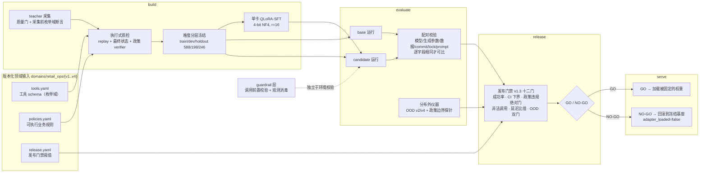

# RetailAgentOps

> **项目状态（2026-09-08）：收尾，暂停开发。**
> 最终发布候选为 `sft-008`（历史判定，见下）。最近三轮迭代各输出一次 `NO-GO`，
> 每一次都把一个新的失败类精确归因并尝试修复：格式滑步 → 解析器协议容忍（门级验证）、
> 措辞域锁定 → 词域覆盖（分布外绝对门历史首过）、封存边界摆动 → 如实入账。
> 逐次判定以 [`docs/HOLDOUT_LEDGER.md`](docs/HOLDOUT_LEDGER.md) 为唯一事实源。

**零售工具 Agent 的单卡领域适配与发布流水线**——把工具 schema、业务政策和任务变成可执行
轨迹，走完数据质检 → QLoRA 后训练 → 执行式评测 → GO/NO-GO 发布门禁 → 推理服务，
全程在一张消费级显卡上。

**可验证性的准确边界**：CPU 全链路**任何人 clone 下来就能复现并断言内容哈希**（一条命令，见下）。GPU 侧的数字（246 条封存 holdout、dev、分布外、政策边界探针）追溯到运行证据的 `report_id`——那是该份证据全字段的自哈希，但**证据文件与模型权重不随仓库分发**（`reports/retail_ops/` 与 `models/` 均 gitignore，理由见 [`NOTICE.md`](./NOTICE.md)）。换句话说：链路和门禁你能自己跑，我这一次跑出来的具体轨迹你不能重放。

**有一条例外，而且是最要紧的那条**：「训练素材与评测素材零重叠」是全部分布外结论的前提，
它的两侧哈希清单**进了 Git**（[`manifests/retail_ops/v1/phrasing_exclusivity.json`](manifests/retail_ops/v1/phrasing_exclusivity.json)）。
交集为空因此是**你可以自己算的集合算术**，不需要相信我；原文仍不出仓（SHA-256 不可逆）。
持有私有产物时另有一条测试钉住「清单 == 产物重算结果」，所以清单也造不了假。

[English](./README.en.md) ｜ [产品规格](./SPEC.md) ｜ [模型卡](./docs/MODEL_CARD_sft-006.md) ｜
[系统卡](./docs/SYSTEM_CARD.md) ｜ [结果完整版](./docs/RESULTS.md)

---

## 这个项目最值得看的四件事

**1. 它把「提示词工程」和「后训练」的功劳分开了。**
2×3 配对实验（2 种 prompt × 3 档容量：零训练 / attention-only / 全 linear，六次运行、每格 60 条冻结任务）证明
两者修的是**不同的失败**，几乎不重叠：一句显式授权指令把"判定可退却不敢执行"从
5/10 提到 9/10，而"工具失败后重试"**零变化**；后训练把重试类 5/10 打到 10/10。

**2. 它能拒绝自己的候选——而且真的拒绝了。**
封存 holdout 上**前三次判定都是 `NO-GO`**。最难的一次：候选做到 **120/120**、
成功率 **+14.2pp**、政策违规与非法调用全部清零，只因 p95 延迟比值 1.88 > 1.25 被拒。
阈值一个字未改（有测试锁定）。第四次把 LoRA **合并回基座权重**后重测——同一份权重、
同一套行为、调用次数一模一样，p95 比值 **1.13**，拿到项目历史上第一个自动门禁 **`GO`**，
并通过 SPEC §6 第 6 条的**独立重建复验**。

**3. 它自己建了分布外集合，把刚拿到的 GO 打掉了一半——然后把它修好了，并算清了账单。**
同一个候选在模板外只有 **0.5833**，"换个说法"这一类 **0/20**、比零训练基座还差。
**120/120 不是泛化**——冻结 holdout 与训练集共用同一批请求模板
（[`docs/OOD_EVALUATION.md`](docs/OOD_EVALUATION.md)）。
诊断到机制（12 句模板全是"请核实…"的书面祈使句，模型学的是**表面形式 → 动作**），
用 LLM 措辞池做训练增强后，在**两份独立生成、各只观测一次**的封存分片上分别做到
**1.0000 与 0.9833**（同一份权重、零训练基座是 0.7667 / 0.7333）。
**代价同样具体**：模型变得更倾向执行，封存 120 条上**同配置两次训练分别有 2 次与 7 次
政策违规**、"做不到的请求"一类从 0.75 掉到 0.60。见
[`docs/GENERALIZATION_FIX.md`](docs/GENERALIZATION_FIX.md)。

**4. 最后三轮迭代，每一轮的 `NO-GO` 都把失败面收敛一格。**
v5 把数据难度偏移修干净后，绝对门 `policy_violation_count_max=0` **历史首过**；
v6 修掉 v5 的唯一失败门（格式滑步 → 解析器协议容忍，`invalid_call_count` 归零）后，
暴露出**「该拒绝」的判定是措辞域锁定的**——同源词域近满分（0.9959）而枚举词域塌方
（探针拒绝侧 0.00–0.107）；v7 把该词域显式放进训练分布，**分布外绝对门
`ood_task_success_min` 历史首过（0.6833 → 0.8333 ≥ 0.70）**、探针近边界修复到逐点
≥ 0.875 且零过校正，但探针远端仍塌、封存面边界摆动——按事先写定的判读规则如实收官。
**门禁的价值不是加分，是逐轮揭穿同源评测面看不见的脆弱性。**

> 引用那个 GO 时必须同时给出分布外读数——这一点由测试强制
> （`test_the_go_is_never_quoted_without_the_ood_reading`）。

---

## 架构



四个接口的产物是**单向、不可覆盖**的：`build` 产数据 → `evaluate` 产证据 → `release`
产判定 → `serve` 只消费判定。依赖方向恒为 `product_cli → retail_ops.* → core.*`，
由治理测试锁定。目录职责见 [`docs/REPO_MAP.md`](./docs/REPO_MAP.md)。

### 让结果可信的五个机制

| 机制 | 做法 |
|---|---|
| **运行证据不可伪造** | 运行报告的 ID 是它自己**全部字段**的自哈希，改一字节即加载失败（已做篡改测试）。另有**逐产物 SHA-256 绑定**——但它只能在私有产物在场时行使，而私有产物不随仓库分发；已对重建与最终候选**完整行使过**（含改 `trajectories.jsonl` 一个字节被拒），见 [`REBUILD_VERIFICATION.md`](docs/REBUILD_VERIFICATION.md) |
| **配对比较有前置条件** | 模型 revision、生成参数、数据集版本、code commit、`uv.lock`、system prompt 哈希**逐字段相同**才允许配对，否则加载失败 |
| **holdout 是封存的** | 两段式授权门 + 五维指纹隔离；每一次观测逐条记在 [`HOLDOUT_LEDGER.md`](docs/HOLDOUT_LEDGER.md)（次数与判定以那份台账为准，本文不复述），且**结果从不反馈进开发、调参或候选选择** |
| **分布外仪器与主判据成对预注册** | OOD 集合与政策边界探针（15 个偏移量 × 措辞域）作为预注册条件与十二门并列——三次在同源面上近满分的候选被它们独立拦下 |
| **门禁可以版本化但不可就地改** | 门禁 ID 逐字节冻结（否则磁盘上已有 release 报告全部无法加载），新口径走新版本；阈值变更次数为 **0**，由三层机器保证 |

---

## 关键结果

**完整展开见 [`docs/RESULTS.md`](docs/RESULTS.md)**（每个数字怎么来的、旁边那个不好看的数、
它不能支持什么）。观测次数与逐次读数的唯一事实源是
[`docs/HOLDOUT_LEDGER.md`](docs/HOLDOUT_LEDGER.md)。下表是摘要，**每一行都带条件**。

| 读数 | 值 | 必须同时说的话 |
|---|---|---|
| 封存 120 条 holdout，最强候选 | **120/120** | 该候选在**分布外**只有 **0.5833**、表达变化一类 **0/20**，比零训练基座还差——**120/120 不是泛化**（冻结 holdout 与训练集共用同一批 12 句请求模板） |
| 发布门禁判定（120 条口径） | 前三次 **NO-GO**，第四次 `GO` | 第一次输在 `success_delta` −0.0333；第二、三次候选做到 120/120 却输在延迟 `p95_latency_ratio` **1.8774**；拿到 GO 的是**同一份权重的合并部署形态**（比值 **1.1265**）——**GO 归因于部署形态，不是模型** |
| 封存 120 条，最终发布候选 `sft-008` | **117/120** 与 **113/120**（同配置两次运行） | 同两次运行的政策违规是 **2 次与 7 次**，全部是「给已过退款期限的订单退款」——代价与修复来自同一个改动 |
| 泛化修复后的分布外封存分片 | **1.0000** 与 **0.9833**（两份独立措辞池） | 零训练基座在第二份上是 **0.7333**；代价是同配置两次训练在封存 120 条上分别有 **2 次与 7 次**政策违规、"做不到的请求"一类 0.75 → 0.60 |
| 246 条封存 holdout（难度分层重建口径，第一轮） | candidate **1.0000** / 政策违规 **0** / 非法调用 **2** | 政策违规绝对门 **历史首过**（5.0× 难度偏移是违规根因的主张被证实）；唯一失败门是 2 次格式滑步（0.8%），判定 **NO-GO（11/12）** |
| 同口径第二轮（解析器修复后） | candidate **0.9959** / 违规 **1** / 非法调用 **0** | 格式门归零（门级验证）；**失败面收敛**：政策违规绝对门 + OOD 绝对门双 FAIL，且暴露「该拒绝」判定**措辞域锁定**（同源近满分 vs 探针拒绝侧 0.00–0.107），判定 **NO-GO（10/12）** |
| 同口径第三轮（枚举词域覆盖后，最终判定） | candidate **0.9797** / 违规 **5** / 非法调用 **0** | **`ood_task_success_min` 0.8333 历史首过（≥0.70）**、探针近边界（−1..−5）修复至逐点 ≥0.875、dev 与探针放行侧零损伤；探针远端（−7/−10/−14）仍塌（0.250–0.625）+ 封存边界摆动，判定 **NO-GO（11/12）+ 探针条件 FAIL**——词域覆盖的泛化是分级次的 |
| 政策边界探针（15 偏移 × 措辞域，每点 n=8） | 修复前拒绝侧 7 点 **0.00–0.107** → 修复后近边界 **≥0.875** | 每点 n=8 的 95% CI 宽度约 ±35pp：**足以看曲线形状，不足以给单点排序** |
| dev 198 条（v5/v6 口径） | base **0.5404** → 候选 **0.9949–1.0000** | dev 已被用于候选选择，**带选择偏差** |
| 独立重建复验（换 seed 重训） | dev **58/60 – 60/60**（三次同配置运行） | 零训练 base **54/60**；同 seed 重跑**产不出逐位相同的权重**（训练是唯一不可逐位复现的环节），不写单点 |
| 独立迁移检查（作者手写，从未用于选择） | 总分 0.5833 → **0.8667** | 同一次改动让 `partial_refund` 从 1.00 掉到 0.00 |
| teacher 数据采集 | 通过率 **98.5–99.2%** | 正式批次成本 **$0.0559** 级（含采集前枚举域断言，返工 0 条） |
| 工程基线 | **1565 tests passed**（作者环境，私有产物齐全） | **干净 clone 上 1513 passed / 52 skipped / 0 failed**（收尾分层复核）；跳过全部因为要读不随仓库分发的私有产物。Ruff / `ruff format --check` / mypy / `uv lock --check` / 公开发布审计在作者环境与 CI 通过 |
| BFCL legacy 轨道 | **163/200** → **167/200** | 项目**自划**的固定单轮 AST 子集，差值置信区间跨 0，**不是**官方全量或排行榜成绩 |

**怎么读这张表**：三次 `NO-GO` 不是失败——第一轮证明「难度偏移是政策违规根因」，
第二轮把失败精确归因到措辞域，第三轮证明「显式词域覆盖」这个处方在靶面上有效
（OOD 绝对门首过、近边界修复、零过校正）且失败被归因到未干预的远端组合与运行方差。
每次判定都没有改阈值，且失败都发生在**分布外仪器**上——同源评测面三次给出过假满分。

## 演示

70 秒的终端演示（`docs/media/demo.mp4`）：四个接口、CPU 全链路复现、**门禁真的拒绝了
一个坏候选**、以及那个 GO 旁边把它打掉一半的分布外读数。

**视频里每一行输出都是真跑出来的**：`scripts/ops/capture_demo_transcript.py` 执行真实命令
并存下 transcript，`scripts/ops/render_demo_video.py` **只读 transcript、不执行任何命令**
（有测试断言它只调用一次 ffmpeg）。两步分开就是为了让渲染阶段没有机会往里加东西。

```bash
.venv/bin/python scripts/ops/capture_demo_transcript.py --output /tmp/demo.json
# 渲染需要 Pillow，装在独立 venv 即可——项目 uv.lock 一个字节不动
<demo-venv>/bin/python scripts/ops/render_demo_video.py --transcript /tmp/demo.json --output docs/media/demo.mp4
```

## 快速开始

```bash
# 1. 装依赖（冻结 lock）
env -u UV_INDEX_URL uv sync --extra dev --frozen

# 2. 一条命令跑完 CPU 全链路并断言结果等于冻结期望值
.venv/bin/python scripts/ci/verify_qualification_chain.py
```

第 2 步就是 `SPEC.md` §11「新环境能按文档完成 CPU smoke」的自动化证明：它跑
`build → evaluate ×3 → release ×2`，然后断言两份 `release.json` 的决策、失败门禁、
`bundle_sha256` / `task_manifest_sha256` 与确定性指标**等于冻结期望值**——
不是"退出码为 0"，是内容哈希相等。

### 质量门

```bash
.venv/bin/pytest -q
.venv/bin/ruff check . && .venv/bin/ruff format --check .
.venv/bin/mypy
env -u UV_INDEX_URL -u UV_DEFAULT_INDEX uv lock --check
.venv/bin/python scripts/ci/audit_public_release.py
```

GitHub Actions workflow 见 [`.github/workflows/ci.yml`](.github/workflows/ci.yml)，
CI 跑的是 CPU 全链路与发布审计，不含 GPU / API 采集。

CPU-only 镜像见 [`Dockerfile`](./Dockerfile)（刻意不含 torch）。**它于 2026-08-16
首次实际构建并验证过**：镜像 1.05 GB，在 `--network none`（完全断网）下跑通全链路——
这比 workflow 更强，因为它证明的是"一个干净环境、没有网络，也能复现并断言内容哈希"。

```bash
docker build -t retail-agent-ops:cpu .
docker run --rm --network none retail-agent-ops:cpu
```

### 手动跑 qualification 链路

输出目录是不可覆盖语义；重复验收时把 `qualification-r1-final` 整体换成新名字。

```bash
R=reports/retail_ops/v1/qualification-r1-final
.venv/bin/retail-agent-ops build    --config configs/retail_ops/build/retail_ops_v1_build.yaml --seed 0 --output_dir $R/build
.venv/bin/retail-agent-ops evaluate --config configs/retail_ops/evaluate/retail_ops_v1_qualification_base.yaml   --seed 0 --input_dir $R/build --output_dir $R/base
.venv/bin/retail-agent-ops evaluate --config configs/retail_ops/evaluate/retail_ops_v1_qualification_oracle.yaml --seed 0 --input_dir $R/build --output_dir $R/oracle
.venv/bin/retail-agent-ops evaluate --config configs/retail_ops/evaluate/retail_ops_v1_qualification_fault.yaml  --seed 0 --input_dir $R/build --output_dir $R/fault
.venv/bin/retail-agent-ops release  --config configs/retail_ops/release/retail_ops_v1_release.yaml --seed 0 --baseline_dir $R/base --candidate_dir $R/oracle --output_dir $R/release-go
.venv/bin/retail-agent-ops release  --config configs/retail_ops/release/retail_ops_v1_release.yaml --seed 0 --baseline_dir $R/base --candidate_dir $R/fault  --output_dir $R/release-no-go
.venv/bin/retail-agent-ops serve    --config configs/retail_ops/serve/retail_ops_v1_serve.yaml --release_dir $R/release-go --input_dir $R/build --output_dir $R/service
```

这套数据是用于验证**工程契约**的合成 qualification；R1 未生成正式 holdout，也没有读取
holdout 真值。BFCL 只保留为独立外部回归，现有 BFCL 成绩不是 RetailOps 内部指标。

### 工具 schema 鲁棒性对照

`perturb_schema` 给工具改别名并打乱参数顺序（键集合不变），两份只差一个开关的配置
回答"换一份客户的工具 schema 还能不能用"：按参数形状解析工具名的 `schema_adaptive`
策略两侧都是 12/12，把 `policy_type` 换成硬编码工具名的 `oracle` 在扰动侧**全灭**
（测试锁定这个对照）。纯 CPU、纯规则、不涉及模型。

---

## 仓库结构

```
src/veritool_rl/
├── product_cli.py    四接口命令面
├── core/             跨领域基础设施（轨迹契约、环境抽象、agent 执行、指标、产物哈希、跨域 teacher）
├── retail_ops/       RetailOps 领域：domain / build / evaluate / release / serve
├── flight_ops/       第二个领域（R8），镜像 retail_ops 四接口，证明领域可替换
├── training/         单卡 QLoRA-SFT
└── legacy/           原 VeriTool-RL 路线（BFCL 外部回归仍在用）
configs/retail_ops/{build,evaluate,release,serve}/   与命令一一对应的运行配置
domains/retail_ops/{v1..v4}/                         工具 schema、业务政策、发布策略（v1 冻结；v2 可执行规则；v3 15 工具；v4 跨工具）
```

分发名与 CLI 是 `retail-agent-ops`，Python 导入名仍是 `veritool_rl`（历史原因，
命名边界见 [`docs/REPO_MAP.md`](./docs/REPO_MAP.md)）。

---

## 结果边界（必须一起说的话）

- **候选没有"可以上线"。** 历史上拿到的**自动门禁 GO**（逐次判定见
  [`docs/HOLDOUT_LEDGER.md`](docs/HOLDOUT_LEDGER.md)）与独立重建复验
  （[`docs/REBUILD_VERIFICATION.md`](docs/REBUILD_VERIFICATION.md)）证明的是流程有效，
  不是泛化：任务集是 2–5 工具 / 12 类 / 单一中文零售退款场景的合成数据，`ci95` 在满分时是
  [1.0, 1.0] 的退化区间——那不是显著性证据。
  **同一个历史候选在分布外只有 0.5833、表达变化一类 0/20**；泛化修复后的候选在封存集上
  **仍有 2–7 次政策违规**（同配置两次运行）。
  **门禁比的是与 base 的差，因此一个违规更多的候选照样能过——这不是可以上线。**
- **最终发布候选是 `sft-008`**：最后一次判定 `NO-GO`（11/12 + 探针条件 FAIL），
  候选未更换。12 门里有 11 门 PASS 且分布外绝对门已历史首过，**剩余的缺口被精确归因**
  （探针远端机制未定、封存边界摆动属运行方差），但按预注册规则，差一门就是差一门。
- **dev 的读数带选择偏差**：dev 已被用于从多个候选中选出这一个，holdout 必然回落。
- **延迟数不可跨运行比较**：GPU 共享，各次运行他人占用 0%–98% 不等。门禁用的是同一次
  运行内的**比值**。
- **`verifier_reward` 四次与主判据反向**，现已降级为诊断量。主判据只有最终状态与政策
  verifier。
- **BFCL 成绩属 legacy 轨道**：Qwen3-1.7B 固定 200 条单轮 AST 子集 Base/SFT 为
  163/200 与 167/200，差值置信区间跨 0，**不是**官方 BFCL 全量或排行榜成绩。
- 不产出论文，不以 SOTA、ablation 数量或三 seed 作为完成标准。

**如果你觉得这里几个数高得可疑**（120/120、三项指标同时为 0、98.5%），
那是对的反应——[`docs/READING_THE_NUMBERS.md`](docs/READING_THE_NUMBERS.md)
逐个说明它们**为什么可能达到**、**旁边那个不好看的数是多少**、以及**不能支持什么结论**。

完整的「不可写表述」纪律与故障覆盖见
[`docs/FAULT_MATRIX.md`](docs/FAULT_MATRIX.md)（五类故障 → 具体测试的映射）。

---

## 文档索引

| 文档 | 内容 |
|---|---|
| [`SPEC.md`](./SPEC.md) | 产品契约、指标、发布门禁、验收原则 |
| [`docs/EXECUTION_PLAN.md`](docs/EXECUTION_PLAN.md) | 阶段状态（唯一事实源，R0–R10 + v5–v7 迭代） |
| [`docs/RESULTS.md`](docs/RESULTS.md) | **关键结果完整版**：每个数字怎么来的、旁边那个不好看的数、它不能支持什么 |
| [`docs/HOLDOUT_LEDGER.md`](docs/HOLDOUT_LEDGER.md) | 封存 holdout 观测台账（逐次判定的唯一事实源） |
| [`docs/PITFALLS.md`](docs/PITFALLS.md) | 27 条踩坑记录 + 已证伪方向表（含每条的归因与出处） |
| [`docs/READING_THE_NUMBERS.md`](docs/READING_THE_NUMBERS.md) | 面向怀疑者：每个高分的机制、它旁边不好看的数、它不能支持什么 |
| [`docs/MODEL_CARD_sft-006.md`](docs/MODEL_CARD_sft-006.md) | 120/120 候选的模型卡 |
| [`docs/MODEL_CARD.md`](docs/MODEL_CARD.md) | 早期候选的模型卡 |
| [`docs/SYSTEM_CARD.md`](docs/SYSTEM_CARD.md) | 系统边界、安全与失败模式 |
| [`docs/OOD_EVALUATION.md`](docs/OOD_EVALUATION.md) | 分布外任务集 v1 与读数（现为独立迁移检查） |
| [`docs/OOD_SEALED_LEDGER.md`](docs/OOD_SEALED_LEDGER.md) | 分布外封存分片台账 |
| [`docs/GENERALIZATION_FIX.md`](docs/GENERALIZATION_FIX.md) | **泛化修复**：诊断、措辞池、封存分片判定与代价 |
| [`docs/POLICY_BOUNDARY.md`](docs/POLICY_BOUNDARY.md) | 政策边界探针：把「该拒绝却执行」定位到单一状态格，以及一次按事先规则判负的修复 |
| [`docs/REBUILD_VERIFICATION.md`](docs/REBUILD_VERIFICATION.md) | 独立重建复验（SPEC §6 第 6 条；训练不可逐位复现的量化） |
| [`docs/GATE_SCHEMA_V11_RECOMPUTE.md`](docs/GATE_SCHEMA_V11_RECOMPUTE.md) | 部署形态归因：同一份权重两种加载方式的门禁复算 |
| [`docs/SERVING_FORM_COMPARISON.md`](docs/SERVING_FORM_COMPARISON.md) | 部署形态与引擎的四档吞吐对照 |
| [`docs/ENGINE_SUBSTITUTION.md`](docs/ENGINE_SUBSTITUTION.md) | vLLM 走完整 evaluate 路径的行为一致性 |
| [`docs/AGENT_LOOP.md`](docs/AGENT_LOOP.md) | Agent 循环、user simulator 与多轮澄清 |
| [`docs/DOMAIN_BUNDLE_V2.md`](docs/DOMAIN_BUNDLE_V2.md) | 政策外置、幂等键、guardrail |
| [`docs/FAULT_MATRIX.md`](docs/FAULT_MATRIX.md) | 五类故障 → 具体测试的映射 |
| [`docs/R8_DIAGNOSIS.md`](docs/R8_DIAGNOSIS.md) | OOD 泛化差的三根因诊断与退化曲线装置教训 |
| [`docs/R9_PHASE_B_RESULTS.md`](docs/R9_PHASE_B_RESULTS.md) | 数据多样性扩展：5 工具 / 12 场景的读数与边界 |
| [`docs/MLOPS_COMPARISON.md`](docs/MLOPS_COMPARISON.md) | 与通用 MLOps 流水线的对照 |
| [`docs/TOOLFACE_MIGRATION_ANALYSIS_E1.md`](docs/TOOLFACE_MIGRATION_ANALYSIS_E1.md) | 工具面迁移分析 |
| [`docs/CI_EVIDENCE.md`](docs/CI_EVIDENCE.md) | CI 首次真跑证据 |
| [`docs/DEMO.md`](docs/DEMO.md) | 演示流程 |
| [`docs/adr/`](docs/adr/) | 架构决策记录 |
| [`NOTICE.md`](./NOTICE.md) | 第三方组件、分发边界（含**文档分层**）、benchmark 声明边界 |

**说明**：本仓库另有一层**作者本地工作文档**（个人材料与 agent 运维记忆），不随仓库
分发，清单与理由见 [`NOTICE.md`](./NOTICE.md)「文档分层」节——工程结论不受影响，
它们全部由上表公开文档承载。

## 许可

MIT，见 [`LICENSE`](./LICENSE)。模型权重、训练数据、holdout 真值与运行产物**不随仓库
分发**，边界与强制方式见 [`NOTICE.md`](./NOTICE.md)。
